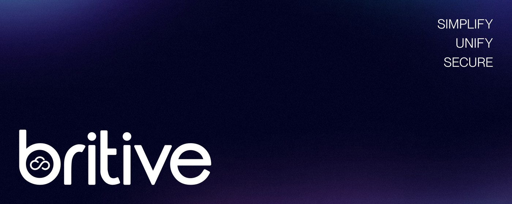

# Britive's Browser Extension

Browser extension(s) for interacting with the [Britive](https://www.britive.com) platform.

## Features

### My Access

Check out and check in access profiles across environments. Profiles are grouped by application and profile name, with environments nested under each profile.

- Favorites are always included; an additional collection can be merged on top
- Approval requests support justification and tenant-configured ticket fields
- Step-up authentication supports TOTP when required by policy
- Approved requests can optionally auto-checkout after approval
- Search filters locally immediately and include non-favorite/collection profiles with longer queries.

### My Approvals

View and act on pending approval requests.

- Approve or reject with an optional comment
- Pending counts are shown on the extension badge
- Realtime updates are delivered over WebSocket

### My Secrets

Browse secrets from your Britive vault.

- Secret metadata is listed in the extension
- Secret values are fetched only when explicitly opened
- Individual fields can be copied on demand
- Web credential filtering by default, adjust with "Show all secret types" setting

### Notifications

- Tenant banner notifications are polled from `GET /api/banner`
- Approval and checkout/checkin lifecycle events are delivered in realtime over WebSocket
- If the popup is closed, supported events are queued and shown when the popup is reopened

### Keyboard Shortcuts

- Open popup + focus Access search: `Ctrl+Shift+K` (`Cmd+Shift+K` on Mac)
- Open popup + Approvals tab: `Ctrl+Shift+Comma` (`Cmd+Shift+Comma` on Mac)
- Open popup + focus Secrets search: `Ctrl+Shift+Period` (`Cmd+Shift+Period` on Mac)

### URL Interception (Firefox only)

- Britive issued AWS STS URL interception for use with multi-account containers
- Custom URL patterns are also supported

## Authentication

The extension uses OAuth 2.0 Authorization Code with PKCE.

High-level flow:

1. User enters a tenant name
2. Extension starts the browser OAuth flow with PKCE
3. User authenticates in the browser-managed auth window
4. Extension exchanges the authorization code for an access token and refresh token
5. Access tokens are refreshed silently while the refresh token remains valid

Notes:

- The previously entered tenant is retained across sessions
- Access tokens are used for normal API requests
- Refresh tokens keep the user logged in without repeating the full login flow

## Supported Builds

```text
firefox/   Firefox extension (Manifest V2)
chrome/    Chrome extension (Manifest V3)
```

## Project Structure

```text
firefox/
  manifest.json
  background.js   # OAuth, API, WebSocket, notifications, secrets, approvals
  popup/          # popup UI
  options/        # standalone settings page
  picker/         # Firefox-only container picker
  icons/

chrome/
  manifest.json
  background.js   # service worker: OAuth, API, alarms, WS coordination
  offscreen.js    # long-lived WebSocket client for MV3
  offscreen.html
  popup/          # popup UI
  options/        # standalone settings page
  icons/
```

## Firefox vs Chrome

| | Firefox | Chrome |
|---|---|---|
| Manifest | V2 | V3 |
| Background model | Persistent background page | Service worker + offscreen document |
| OAuth API | `browser.identity` | `chrome.identity` |
| WebSocket client | `background.js` | `offscreen.js` |
| Refresh scheduling | timer | `chrome.alarms` |
| Storage | `browser.storage.local` | `chrome.storage.local` + `chrome.storage.session` |
| Multi-Account Containers | Yes (`contextualIdentities`) | Not available |

## Settings

Configurable via the popup sidebar or the standalone options page:

- Banner notifications
- Banner poll interval
- Tab visibility (Access, Approvals, Secrets)
- Theme
- Zoom level
- Text buttons
- Additional collection merge for My Access
- Checkout expiry notification
- Auto-checkout after approval
- Show all secret types
- Britive issued AWS STS interception (Firefox only)
- Custom URL interception patterns (Firefox only)

## Additional Information

- [Installation](INSTALL.md)
- [License(MIT)](LICENSE)
- [Privacy Policy](PRIVACY.md)